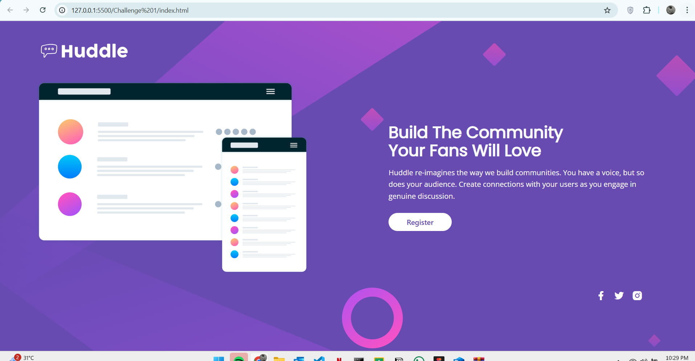
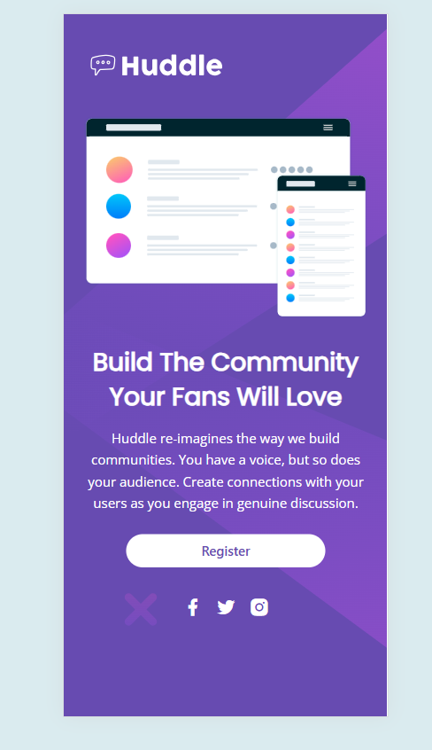

# Frontend Mentor - Huddle landing page with single introductory section solution

This is my solution to the [Huddle landing page with single introductory section challenge on Frontend Mentor](https://www.frontendmentor.io/challenges/huddle-landing-page-with-a-single-introductory-section-B_2Wvxgi0). This challenge helped me refresh my frontend skills, especially with modern CSS and Tailwind.

## Table of Contents

- [Overview](#overview)
  - [The Challenge](#the-challenge)
  - [Screenshot](#screenshot)
- [My Process](#my-process)
  - [Built With](#built-with)
  - [What I Learned](#what-i-learned)
  - [Continued Development](#continued-development)
  - [Useful Resources](#useful-resources)
- [Author](#author)

## Overview

### The Challenge

Users should be able to:

- View the optimal layout for the page depending on their device's screen size
- See hover states for all interactive elements on the page

### Screenshot

## My Process

### Built With

- Semantic **HTML5**
- **TailwindCSS**
- **Flexbox** for layout
- **Mobile-first responsive design**

### What I Learned

This project helped me refresh and solidify:

- Core CSS layout concepts like flexbox
- Building responsive designs with Tailwind's utility classes
- Setting up and customizing fonts in Tailwind
- Writing clean, scalable, and reusable layout code

### Continued Development

I’d like to continue improving on:

- Planning layouts before diving into code
- Deepening my understanding of when to use flex vs grid
- Creating cleaner and more maintainable utility-based styles

### Useful Resources

- [TailwindCSS Documentation](https://tailwindcss.com/docs) – My go-to reference while building this project.

## Author

- Frontend Mentor - [@Zeeshan506](https://www.frontendmentor.io/profile/Zeeshan506)
- GitHub - [ZeeshanAzhar](https://github.com/Zeeshan506)
